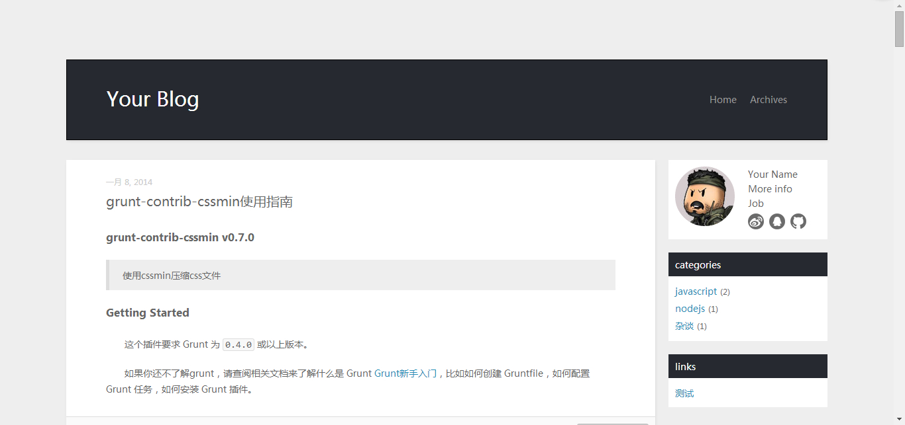
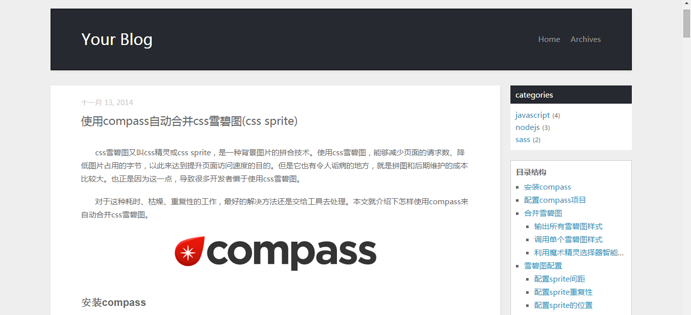

# hexo-diy-strict





hexo-diy-strict是基于[strict](https://github.com/unmric/hexo-theme-strict)主题修改而成，在strict基础上进行了如下修改:

### 2015.01.08更新
1. 文章页增加文章结构目录(catalog widget)
2. 增加返回顶部代码
3. 修复多说评论框不显示bug
4. 调整部分样式

### 2014.05.02更新
1. 增加了对IE7的兼容
2. 将布局改为两栏式
3. 增加了部分widget(about/categories/links)
4. 使用多说作为默认评论组件，hexo-diy-strict/_config.yml中填写多说的`short_name`
5. 其它细节处的样式调整

## Installation

**Install**
```
$ npm install hexo-renderer-jade --save
$ git clone git@github.com:8788/hexo-diy-strict.git themes/hexo-diy-strict
```

**Enable**

Modify `theme` setting in `_config.yml` to `hexo-diy-strict`.


## Browser Support
- IE 7+
- Latest Stable: Firefox, Chrome, Safari

## License
MIT